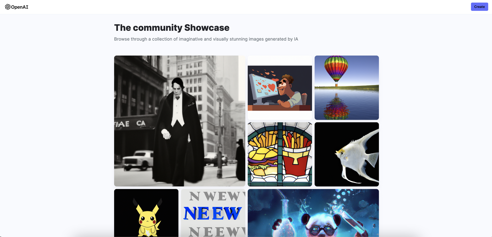
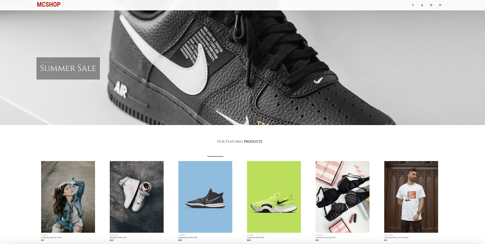
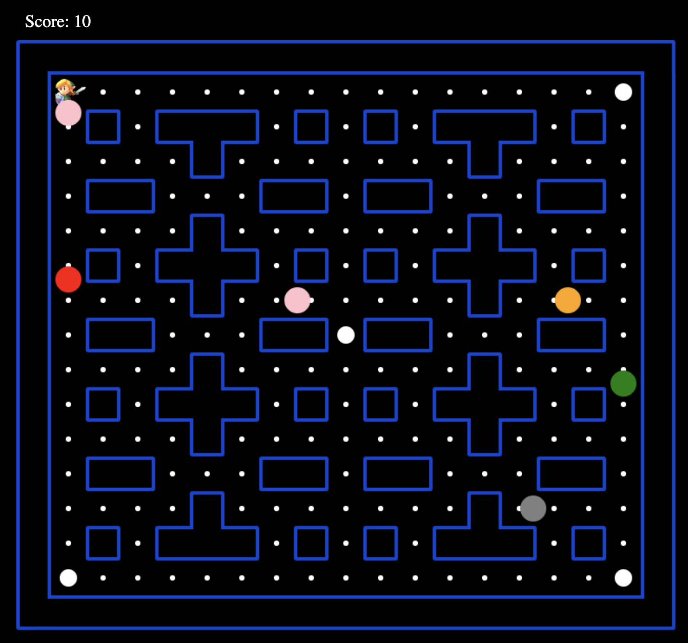

# Hi there, I'm Oscar 

##  About me:

-  Curious and good observer.
-  Always learning.
-  Restless for discovering new things.

## 🔧 Technologies & Tools

## ✨ My projects

### Youtube Clone

 
[Youtube clone](https://osalva-yt.netlify.app/) is a **Full Stack application**. 

### AI-Image-generation

 
[AI Image generation](https://osalva-ai.vercel.app/) It is an application that can create realistic images and art from a natural language description.

### MC SHOP

 
[MC SHOP](https://mcshop.vercel.app/) It is an app like a clothing ecommerce store.

### Zelda Pacman

 
[Zelda Pacman](https://osalva.github.io/Pacman/) It is a game like the classic pacman game in which you are Link and you must eat all the spheres of power avoiding all the colored balls.
 

---

Contact me:

